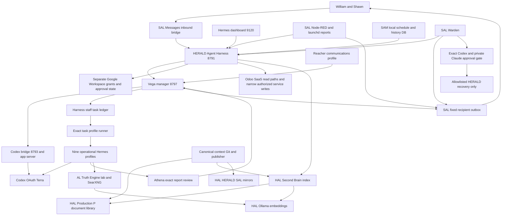

# Windance stack dependencies

Companion to [the baseline](AGENTIC_STACK_BASELINE_2026-09-30.md). Solid connections below represent inspected configuration/source or live records, not a fresh end-to-end transaction on every edge. External authentication, delivery and failover qualifications are in the baseline.

Phone intake is intentionally disabled and is not an active user entry path. The loaded phone service is not permission to enable calls. Existing scheduled report routes are heterogeneous; the diagram's outbox edge does not imply every historical report used iMessage.

| Dependency | Persistent state or runtime | Failure effect and recovery concern |
|---|---|---|
| HERALD manager | `~/.local/share/vega-manager/manager.db`, report artifacts, `services/vega-manager` | Orchestration and owner/session association; reconcile accepted work before resuming |
| Harness | `~/.local/share/agent-harness/harness.db`, service source, trusted caller boundary | Staff records, approvals, reports, shared memory and Odoo/Google adapters; partial export is not a replacement DB |
| Hermes | Pinned upstream plus local patches, isolated profiles, operational session DBs, connector environments | Runtime/provider/tool compatibility; MCP 1.x connector environment differs from main Hermes environment |
| Codex bridge | Existing authenticated app server, service source and private runtime state | Common reasoning path for manager and front door; OAuth/quota/internet loss can affect multiple agents |
| SAL Messages | Signed Python.app identity, GUI login, TCC/Automation grants, cursor, outbox claims/results | Identity and cursor are essential; avoid duplicate intake and uncertain-send replay. These permissions are not reconstructed by copying source. |
| SAL schedules | Node-RED flow, launchd jobs and outcome receipts | Scheduled action and delivery are separate stages; do not load copied flows during isolation |
| Warden | SAL incident DB, reviews, reservations, exact code/config fingerprints | Depends on SAL itself; its healthy checks are narrower than full-stack health. Missing dual approval holds repair. |
| SAM | Local SQLite, Python app, systemd timers, kiosk and Wi-Fi | Local completion history and receipts; Odoo root Training fields remain human-owned |
| Odoo and Workspace | SaaS state and existing private grants | Local backup does not restore SaaS data, authorization or mailbox maps; no new write workflow authorized |
| HAL knowledge | Canonical Git, P documents, live Second Brain SQLite, Ollama | Loss of HAL can remove source library, index and local embeddings together |
| AL | Separate production/lab WebUI volumes, SearXNG/Valkey containers | Image digest alone does not restore user documents, chat, login state or persisted WebUI settings |
| NAS chain | Odyssey, TMA-1, TMA-2 | Hosts reachable; replication completeness and independent usable recovery not verified |
| Public access | SAL Cloudflared, DNS and existing authentication | Cloudflared process verified; no public sign-in or carrier call performed |

Vega's HAL heartbeat is an additional observation path that depends on HAL/Codex availability. It does not replace the HERALD controller or Warden consensus. Private counselor memories have no edge into shared operational knowledge and were not inspected. SyncThing is outside the audit's modification scope.
